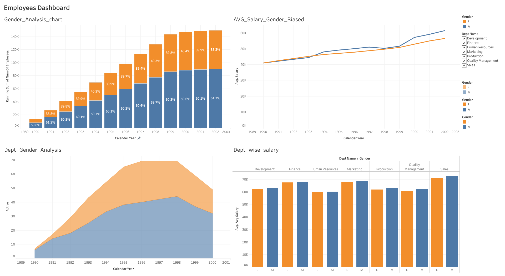

# Employee Compensation & Gender Analysis  
SQL + Tableau End-to-End Data Project

---

## 📌 Project Overview

This project analyzes employee compensation data to identify salary trends, department-level differences, and potential gender-based pay disparities.

The objective was to simulate a real-world HR analytics scenario where leadership wants visibility into compensation structure, growth trends, and equity insights.

---

## 🎯 Business Questions

- How does average salary vary by department?
- Are there noticeable gender-based salary gaps?
- How have salaries evolved over time?
- Which departments show the highest compensation growth?
- Where might HR need to investigate potential disparities?

---

## 🗂 Dataset Structure

The analysis was performed using a relational employee database containing:

- **employees** – employee demographic data  
- **departments** – department details  
- **dept_emp** – employee-department mapping  
- **salaries** – salary history with contract dates  

This structure required multi-table joins and historical trend analysis.

---

## 🛠 Tools & Technologies

- **MySQL**
  - Joins
  - Aggregations (AVG, COUNT, SUM)
  - Window Functions (LAG, LEAD)
  - Grouping & Filtering (HAVING, WHERE)
- **Tableau**
  - Dashboard design
  - KPI visualization
  - Interactive filtering
  - Trend analysis visuals

---

## 🧠 Key Analysis Performed

- Average salary by department and gender
- Department-level compensation comparison
- Salary growth trend over time
- Gender-based compensation difference analysis
- Historical contract-based salary evolution

---

## 📊 Dashboard Preview

### Employee Compensation Overview

---

## 🔎 Key Insights

- Certain departments show significantly higher average compensation.
- Gender-based salary gaps are visible in selected departments.
- Salary growth trends accelerate post-1998.
- Finance and Marketing demonstrate higher salary variance compared to HR.

These findings simulate how HR leadership could identify potential equity concerns or compensation optimization opportunities.

---

## 🧾 SQL Implementation

All analysis queries include:

- Multi-table INNER JOIN operations
- Aggregations grouped by department and gender
- HAVING filters for salary thresholds
- Window functions for trend comparison
- Date-based filtering for contract period analysis

(Recommended improvement: move queries into a dedicated `/sql` folder for full visibility.)

---

## 📈 Why This Project Matters

Compensation analytics is a core function in:

- HR Analytics
- Workforce Planning
- Organizational Equity Monitoring
- Financial Forecasting

This project demonstrates the ability to:

- Work with relational schema
- Extract structured datasets from SQL
- Transform raw data into decision-support dashboards
- Translate technical output into business insights

---

## 🚀 Future Improvements

- Publish interactive dashboard to Tableau Public
- Automate SQL → CSV → Visualization workflow
- Add statistical testing for gender gap validation
- Convert project into an ETL-style pipeline

---

## 👤 Author

Sai Bhaskar Ganesh Gandi  
